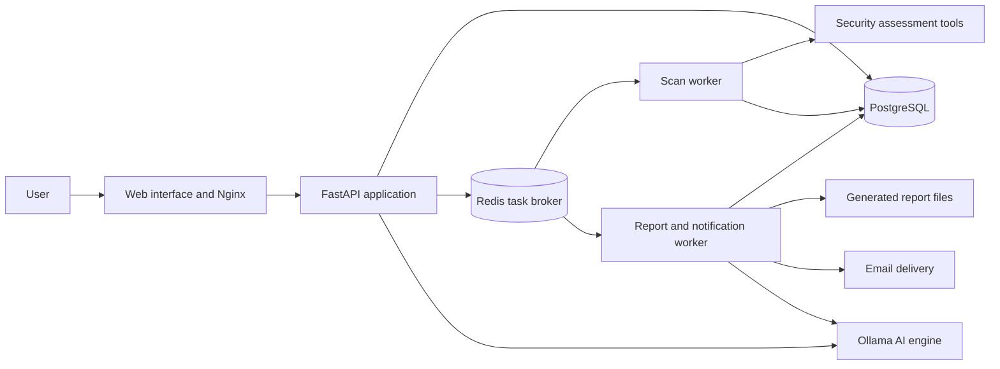

# NetNeedle

### From exposed services to clear security decisions.

NetNeedle is a full-stack cybersecurity assessment platform that helps users
map their external attack surface, review web security findings, and turn scan
evidence into actionable reports. It brings account management, controlled
scanning, progress tracking, reporting, and administration into one workspace.

The project combines security tooling with product design and backend engineering:
users can follow an assessment from its initial configuration to a report that
developers and managers can both use.

[Explore the screenshots](#product-tour) · [See the engineering](#engineering-highlights) · [Deployment guide](deploy.md) · [Source code](https://github.com/bericontraster/NetNeedle)

> **Cover screenshot placeholder**  
> Add a wide screenshot of the public homepage or your strongest dashboard view.

<!-- Replace the placeholder above with this image after adding the file:

-->

## The problem it addresses

Security tools often produce separate outputs that require additional work to
understand, prioritize, and share. Developers need specific evidence and fixes;
managers need an understandable view of risk and the next actions to take.

NetNeedle connects those needs through a shared workflow: define the assessment
scope, run the appropriate checks, review normalized findings, and generate
reports for different audiences from the same underlying evidence.

## What users can do

| Capability | What it delivers |
| --- | --- |
| **Network assessment** | Discover reachable hosts, open ports, services, and DNS, HTTP, and TLS observations within a configured scope. |
| **Web assessment** | Crawl website pages and review headers, cookies, technologies, exposed resources, and supported scanner findings. |
| **Advanced web assessment** | Configure deeper, authorization-gated testing with authentication options, bounded tool execution, and evidence tracking. |
| **Scan management** | Follow incremental progress, inspect findings, stop jobs, restart assessments, and resume supported scan types. |
| **Reports for two audiences** | Export executive and detailed assessment reports as HTML or PDF, with risk summaries, evidence, and remediation guidance. |
| **Accounts and administration** | Use email verification and password recovery, manage profiles and plans, review payment submissions, and administer users. |
| **AI support and report narratives** | Use an Ollama-backed support agent and evidence-bounded report explanations when an AI engine is configured. |

## A complete assessment workflow

1. **Create an account.** Register, verify the emailed code, and sign in.
2. **Define the scope.** Choose a scan type, enter targets and exclusions, and configure the permitted checks.
3. **Start the assessment.** Background workers execute the scan while the dashboard shows progress and findings.
4. **Review the evidence.** Inspect severity, confirmation status, affected targets, and the observations behind each finding.
5. **Share the result.** Generate an executive report for decision-makers or a detailed report for technical follow-up.

Scans continue on the server after the user leaves the browser. The application
stores their state so users can return to review results and generate reports.

## Product tour

The placeholders below are ready for your screenshots. Save images under
`docs/screenshots/`, then replace each placeholder with its Markdown image line,
removing the surrounding `<!--` and `-->` comment markers. Use sample or
anonymized assessment data for the public showcase.

### 1. Overview dashboard

A central workspace for assessment activity, scan status, and security findings.

> **Screenshot placeholder — Dashboard**  
> Show the overview with populated scan activity and summary cards.

<!--  -->

### 2. Assessment configuration

Users choose the assessment type and define its scope and execution settings
before starting a scan.

> **Screenshot placeholder — Scan configuration**  
> Show the scan selection screen or a populated configuration form with targets,
> exclusions, and scope controls visible.

<!--  -->

### 3. Progress and findings

Incremental results make the assessment observable while it runs. Findings retain
their source and evidence so users can understand what a check actually found.

> **Screenshot placeholder — Scan results**  
> Show scan progress and a finding's severity, confirmation status, and evidence.

<!--  -->

### 4. Executive report

A management-focused view of the assessment, its risk summary, and recommended
actions, built from the same findings used in the technical report.

> **Screenshot placeholder — Executive report**  
> Show a report page with the risk overview and management recommendations.

<!--  -->

### 5. Detailed assessment report

A technical view of findings, captured evidence, affected endpoints, and
remediation guidance for investigation and implementation.

> **Screenshot placeholder — Detailed report**  
> Show a readable finding page with evidence and recommended fixes.

<!--  -->

### 6. Administration

An administration workspace supports user management, subscription changes,
payment review, and AI configuration.

> **Screenshot placeholder — Admin workspace**  
> Show the admin overview or payment review interface using sample account data.

<!--  -->

## Engineering highlights

### Background processing with visible state

FastAPI handles application requests while Celery workers execute longer-running
tasks. Scans use a dedicated queue; reports and notifications run in a separate
worker. PostgreSQL stores application data and assessment state, while Redis
provides the task broker. This separation keeps scan execution and report
generation outside the browser request lifecycle.

### Reports grounded in evidence

Executive and detailed reports share normalized findings and deterministic risk
calculations. Confirmation status distinguishes confirmed findings, issues that
need manual validation, and informational observations.

AI can contribute explanations and remediation prose, while counts, severity,
evidence, and scoring remain controlled by application logic. Generated narratives
are validated, and reports use deterministic text when AI output is unavailable
or unsuitable.

### Controlled scanner integration

The scanner pipeline combines built-in checks with specialist tools such as
Nmap, Masscan, Nuclei, WhatWeb, Nikto, and testssl.sh. Targets and exclusions are
validated, execution has time and scope limits, and tool status is recorded.
Supported checks depend on the scan configuration and available tooling.

Sensitive scan credentials are encrypted when new configurations are saved and
redacted from normal responses and command previews. Authenticated assessments
support configured credentials, cookies, or tokens, with browser-assisted login
for supported JavaScript applications.

### Product interface and repeatable delivery

The frontend combines JavaScript application controllers with React-powered
public pages and Three.js visuals. The repository includes frontend checks,
browser verification scripts, backend tests, and a GitHub Actions workflow for
frontend verification and builds. Docker Compose assembles the services, and
Alembic applies the database schema history during startup.

## Architecture at a glance

## Technology stack

| Area | Technologies |
| --- | --- |
| Frontend | JavaScript, React, Vite, HTML/CSS, Three.js, GSAP |
| API and application logic | Python, FastAPI, Pydantic |
| Database | PostgreSQL, SQLAlchemy, Alembic |
| Background jobs | Celery, Redis |
| Assessment tooling | Nmap, Masscan, Nuclei, WhatWeb, Nikto, and additional specialist scanners |
| Reporting and AI | HTML/CSS report templates, WeasyPrint PDF generation, Ollama |
| Deployment and automation | Docker, Docker Compose, Nginx, GitHub Actions |

## What this project demonstrates

| Skill area | Concrete work in the repository |
| --- | --- |
| **Full-stack development** | Account workflows, authenticated APIs, frontend views, persisted scans, and report delivery. |
| **Backend system design** | Queue routing, worker separation, scan lifecycle management, and database migrations. |
| **Security engineering** | Scope validation, authentication controls, secret handling, bounded execution, and evidence-aware findings. |
| **Applied AI engineering** | Schema-validated narratives, controlled factual fields, and deterministic fallbacks. |
| **Product thinking** | Separate reports for managers and technical teams, guided scan configuration, and administration workflows. |
| **Delivery and maintainability** | Containerized services, automated frontend checks, focused backend tests, and deployment documentation. |

## Current scope

The implemented assessment workflows cover network, web, and advanced web scans.
Authenticated Windows operating-system assessment is marked **coming soon** in
the interface. Some specialist checks require additional tooling, credentials,
or explicit configuration; their availability is reflected in execution status.

NetNeedle is designed for assessments of assets the user owns or is authorized
to test. Findings preserve uncertainty where additional manual validation is
needed.

## Explore the implementation

- [Deployment and operations](deploy.md) — setup, configuration, HTTPS, verification, and backups.
- [Network assessment methodology](readme.md) — scope controls and the implemented assessment approach.
- [Frontend architecture and checks](docs/frontend-tooling.md) — public pages, application controllers, and build verification.
- [Scan orchestration](backend/app/tasks/scan_tasks.py) — background execution and assessment state.
- [Report generation](backend/app/services/report_service.py) — shared report data, rendering, and delivery.
- [Report validation tests](backend/tests/test_report_generation.py) — evidence, scoring, fallback, and report consistency checks.
